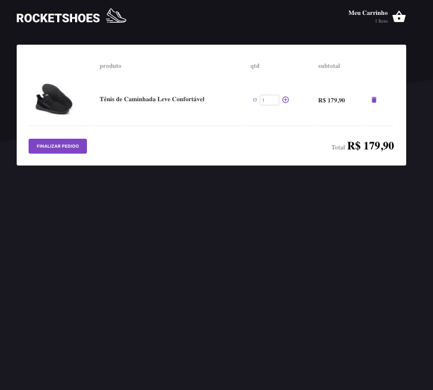

<h1 align="center">
  
</h1>

<h3 align="center">
      RocketShoes
</h3>

<blockquote align="center">“Não fique olhando o relógio faça como ele mexa-se”!</blockquote>

<p align="center">
  
  
</p>

<p align="center">
  <a href="#Sobre o Projeto">Sobre o projeto</a>&nbsp;&nbsp;&nbsp;|&nbsp;&nbsp;&nbsp;
  <a href="#Dependencias">Dependencias</a>&nbsp;&nbsp;&nbsp;|&nbsp;&nbsp;&nbsp;
  <a href="#Ferramentas">Ferramentas</a>&nbsp;&nbsp;&nbsp;|&nbsp;&nbsp;
</p>

## Rocketshoes: Sobre o projeto

Esta aplicaçao foi desenvolvido com intuido de aprender arquitetura Flux. Sera Desenvolvido uma exemplo de E-commerce de venda de sapatos **RocketShoes**.

<h1 align="center">
  
  
</h1>


### Ferramentas utilizadas

- ESLint + Prettier + EditorConfig;
- Json-server

### Funcionalidades

Adicionar produtos ao carrinho de compras

### Informações para uso do codigo

Para esta aplicaçao voce precisar ter instalado o [Yarn][yarn] no seu computador para conseguir usar as linhas de comando abaixo.

```bash
#Clone o repositorio com o comando
$git clone https://github.com/guilhermeseckert/rocketshoes
RocketShoes


#Navegue ate pasta
$ cd rocketshoes

#Instalar as dependencias do projeto
$ yarn install

#Iniciar o json server
$ json-server server.json -p 3333

#Iniciando o projeto
$ yarn start
```

<h1 align="center" border-radius= "50%">
  
</h1>

Made with by Guilherme S.Eckert :wave: [Get in touch!](https://www.linkedin.com/in/guilherme-eckert/)

[nodejs]: https://nodejs.org/
[yarn]: https://yarnpkg.com/
[docker]: https://www.docker.com/
